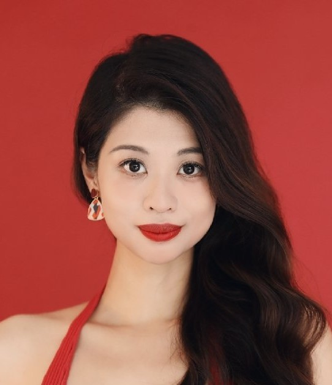

### Usage

```shell
cd /data2/yhwang/sadtalker
conda init
conda activate sadtalker
export LD_LIBRARY_PATH=$LD_LIBRARY_PATH:/data2/yhwang/anaconda/lib/
# Edit the run.sh file
bash run.sh
```

Explanations of the configuration parameters at the bottom.


### Examples

#### Input image 1 in folder ("case2") with 47 seconds audio


###### 1. --face3dvis     --ref_pose      --still   			(3-4min)

<video src="cases/case2/sam1##sam.mp4"></video>

###### 2. --face3dvis     	--ref_pose--ref_pose 	--ref_eyeblink 	--enhancer RestoreFormer , total 24min

**enhancer takes extra 20min**

<video src="cases/case2/2024_04_19_13.05.26.mp4"></video>

###### 3. --face3dvis     	--ref_pose--ref_pose 	--ref_eyeblink 	--preprocess full (total 29min)

**`--preprocess full` takes extra 25min**， if you can't see this video, open `cace2/full.mp4`

<video src="cases/case2/full.mp4" height="500"></video>

#### Input image 2 (in folder "case1") with 8 seconds audio


```
--ref_pose:    cases/case1/WDA_KatieHill_000.mp4 

--ref_eyeblink:  cases/case1/WDA_AlexandriaOcasioCortez_000.mp4
```

1. ######           --ref_eyeblink  --ref_pose	 --face3dvis     (2min)

<video src="cases/case1\2024_04_19_15.02.07.mp4"></video>

2. ###### --ref_eyeblink  --ref_pose	--enhancer RestoreFormer	 --face3dvis , total 4min30s

   <video src="cases/case1\2024_04_19_15.19.14.mp4"></video>

3. ###### --ref_eyeblink  --ref_pose	--enhancer RestoreFormer --face3dvis  --enhancer RestoreFormer 

Total 5min

<video src="cases/case1\2024_04_19_15.33.02.mp4"></video>

In **`resize`** mode, we resize the whole images to generate the fully talking head video. Thus, an image **similar to the ID photo** can be produced. ⚠️ It will produce **bad results for full person images**.

#### Input image 3  (in folder "case4") with 9 seconds audio


```
--ref_pose:    cases/case1/WDA_KatieHill_000.mp4 

--ref_eyeblink:  cases/case1/WDA_AlexandriaOcasioCortez_000.mp4
```

###### 1. --ref_eyeblink  --ref_pose	 --face3dvis ,total 2min

<video src="cases/case4\2024_04_19_15.39.31.mp4"></video>

###### 2. --ref_eyeblink  --ref_pose	 --face3dvis    --preprocess resize     --enhancer RestoreFormer, total 5min 30s

*Bad* example for resize!

<video src="cases/case4\2024_04_19_15.49.14.mp4"></video>

###### 3. --ref_eyeblink  --ref_pose	 --face3dvis    --preprocess crop    --enhancer RestoreFormer, total 5min 30s

<video src="cases/case4\2024_04_19_16.00.32.mp4"></video>

###### 4. --ref_eyeblink  --ref_pose	 --face3dvis     --enhancer gfpgan, total 5min 30s

<video src="D:\OneDrive - CUHK-Shenzhen\桌面\Year4Term8\CSC4050\talker\cases\case4\2024_05_02_14.21.43.mp4"></video>

5. ###### --ref_eyeblink  --ref_pose     --enhancer gfpgan, total 5min 30s

   <video src="D:\OneDrive - CUHK-Shenzhen\桌面\Year4Term8\CSC4050\talker\cases\case4\2024_05_02_14.30.06.mp4"></video>

6. ###### --ref_eyeblink   --face3dvis    --enhancer gfpgan, total 5min 30s

   <video src="D:\OneDrive - CUHK-Shenzhen\桌面\Year4Term8\CSC4050\talker\cases\case4\2024_05_02_15.18.02.mp4"></video>

#### Input image 4



###### --face3dvis 	--ref_pose	 --ref_eyeblink 	--preprocess resize  

<video src="cases/case3/2024_04_19_12.31.02.mp4"></video>

###### --ref_pose 	--ref_eyeblink 	--preprocess resize 	 --still

<video src="cases/case3/2024_04_19_12.59.35.mp4"></video>


### Troubleshooting

1. **`Important`** If the following error occurs: 

   ```
   ImportError: /usr/lib/x86_64-linux-gnu/libstdc++.so.6: version `GLIBCXX_3.4.26' not found (required by /data2/yhwang/anaconda/envs/sadtalker/lib/python3.8/site-packages/pytorch3d/_C.cpython-38-x86_64-linux-gnu.so)
   ```

   Run:

   ```shell
   export LD_LIBRARY_PATH=$LD_LIBRARY_PATH:/data2/yhwang/anaconda/lib/
   ```

2. If `conda init` fails, run:

   ```shell
   source /home/yhwang/.bashrc
   ```

   

### Advanced configuration options for `inference.py`:

| Name                | Configuration                                          | default     | Explaination                                                 |
| :------------------ | :----------------------------------------------------- | :---------- | :----------------------------------------------------------- |
| Enhance Mode        | `--enhancer`                                           | None        | Using `gfpgan` or `RestoreFormer` to enhance the generated face via face restoration network |
| Background Enhancer | `--background_enhancer`                                | None        | Using `realesrgan` to enhance the full video.                |
| Still Mode          | ` --still`                                             | False       | Using the same pose parameters as the original image, fewer head motion. |
| Expressive Mode     | `--expression_scale`                                   | 1.0         | a larger value will make the expression motion stronger.     |
| save path           | `--result_dir`                                         | `./results` | The file will be save in the newer location.                 |
| preprocess          | `--preprocess`                                         | `crop`      | Run and produce the results in the croped input image. Other choices: `resize`, where the images will be resized to the specific resolution. `full` Run the full image animation, use with `--still` to get better results. |
| ref Mode (eye)      | `--ref_eyeblink`                                       | None        | A video path, where we borrow the eyeblink from this reference video to provide more natural eyebrow movement. |
| ref Mode (pose)     | `--ref_pose`                                           | None        | A video path, where we borrow the pose from the head reference video. |
| 3D Mode             | `--face3dvis`                                          | False       | Need additional installation. More details to generate the 3d face can be founded [here](docs/face3d.md). |
| free-view Mode      | `--input_yaw`,<br> `--input_pitch`,<br> `--input_roll` | None        | Genearting novel view or free-view 4D talking head from a single image. More details can be founded [here](https://github.com/Winfredy/SadTalker#generating-4d-free-view-talking-examples-from-audio-and-a-single-image). |

